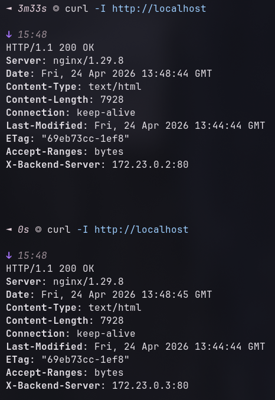
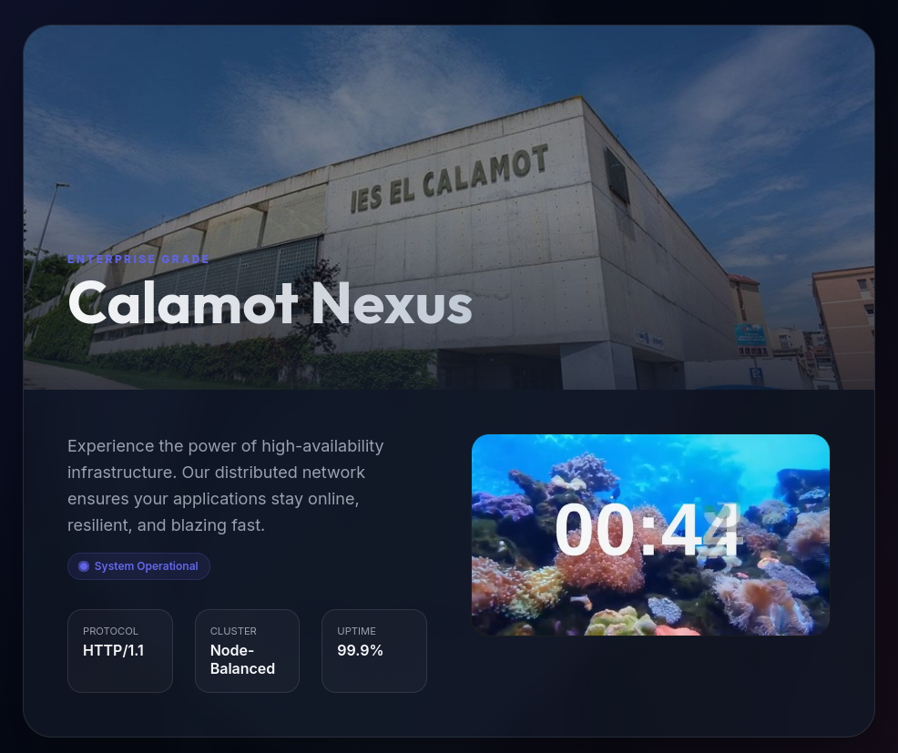

# Hecho por: Hugo Mata
# Calamot Nexus | Infraestructura con Proxy Inverso

Este proyecto implementa una solución de alta disponibilidad y balanceo de carga utilizando contenedores Docker.

## Arquitectura del Sistema

```text
          [ CLIENTE (Internet/Host) ]
                      |
                      ▼
              [ PUERTO 80 (Host) ]
                      |
      ┌───────────────┴───────────────┐
      │                               │
      │        NGINX PROXY            │ (Balanceador de Carga)
      │      (exam-nginx-proxy)       │
      │                               │
      └───────┬───────────────┬───────┘
              │               │
      ┌───────▼───────┐       ┌───────▼───────┐
      │               │       │               │
      │  WEB SERVER 1 │       │  WEB SERVER 2 │ (Aislados)
      │               │       │               │
      └───────┬───────┘       └───────┬───────┘
              │               │
              └───────┬───────┘
                      ▼
              [ VOLUMEN COMPARTIDO ]
                   (Carpeta ./html)
```

## Decisiones de Diseño

### 1. Selección de Imagen Docker (`nginx:latest`)
Hemos elegido la imagen oficial de **Nginx** por las siguientes razones:
*   **Estabilidad y Seguridad**: Es la imagen oficial mantenida por el equipo de Nginx, lo que garantiza parches de seguridad frecuentes.
*   **Rendimiento**: Es extremadamente ligera y está optimizada para manejar miles de conexiones simultáneas con un consumo mínimo de recursos.
*   **Versatilidad**: Permite funcionar tanto como servidor web estático como proxy inverso avanzado sin necesidad de software adicional.

### 2. Estructura de Red (Bridge Interna)
La red está configurada como una `bridge` interna denominada `internal_network`:
*   **Seguridad por Aislamiento**: Los servidores web (`web1` y `web2`) no exponen puertos al sistema host. Esto significa que **solo el proxy** puede comunicarse con ellos.
*   **Resolución DNS Automática**: Docker permite que el proxy se conecte a los backends usando sus nombres de servicio (`http://web1`), simplificando la configuración de Nginx.
*   **Control de Tráfico**: Centralizar todo el tráfico en el proxy permite implementar políticas de seguridad, logs y balanceo en un único punto.

## Capturas de Pantalla


*Interfaz de usuario premium de Calamot Nexus.*


*Visualización de componentes del sistema.*

## Instrucciones de Despliegue

Para poner en marcha todo el sistema, simplemente ejecuta el siguiente comando en la raíz del proyecto:

```bash
docker compose up -d
```

### Comandos útiles:
*   **Ver estado de los contenedores**: `docker compose ps`
*   **Ver logs en tiempo real**: `docker compose logs -f`
*   **Detener el sistema**: `docker compose down`

Una vez levantado, el servicio estará disponible en **http://localhost**.
